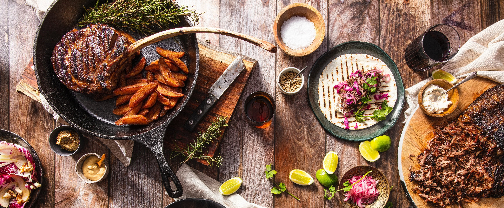
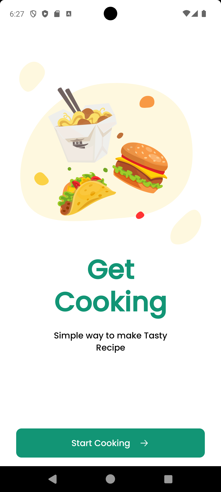
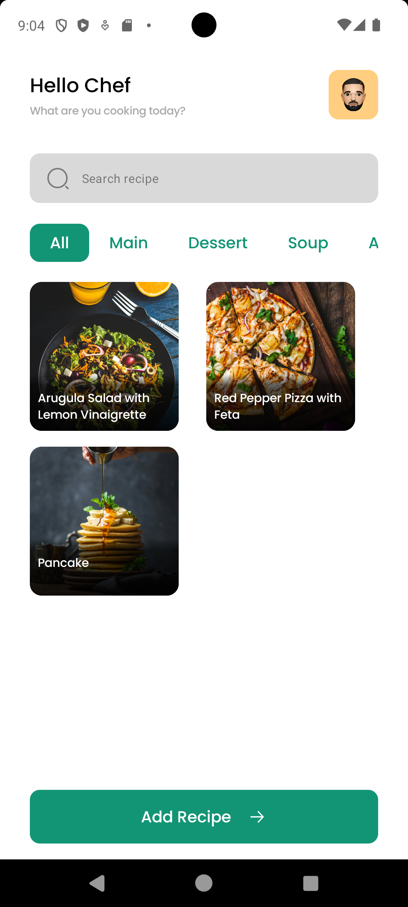
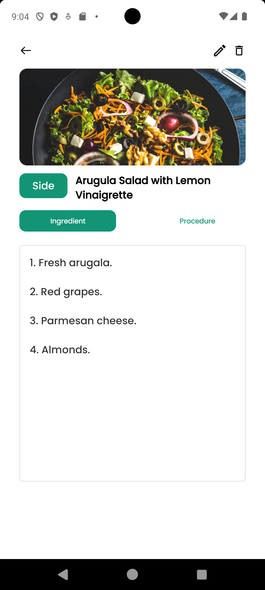
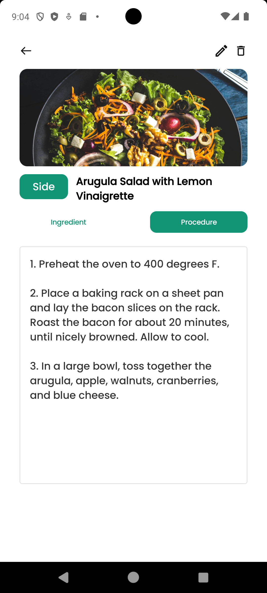
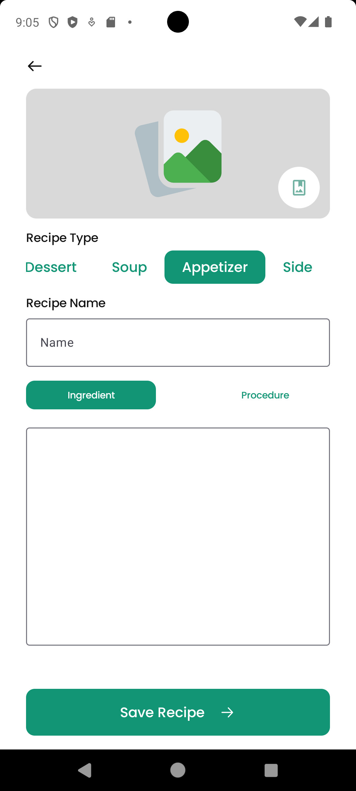
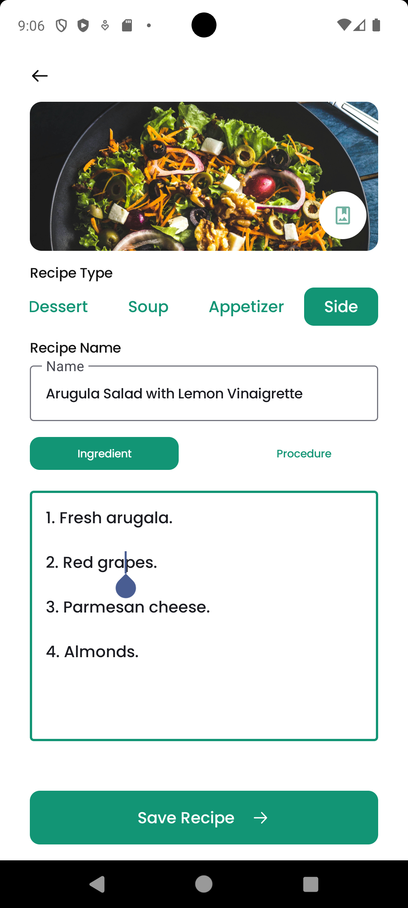

# Recipe-Maker

    

Recipe Maker is a simple Android app built entirely with Kotlin and Jetpack Compose. It follows Modern Android development with some of its best practices such as MVVM, Jetpack Compose, Dependency Injection and Repository Pattern.

# Screenshots

  
    &nbsp;
   
    &nbsp;
   
    &nbsp;
  
    &nbsp;
  
    &nbsp;
  

# Features
Recipe Maker allows users to create a list of recipes. It is also able to persist the recipes in a local NoSQL database.

# Architecture
- <a href="https://developer.android.com/topic/architecture">MVVM</a> with <a href="https://developer.android.com/reference/kotlin/androidx/compose/runtime/MutableState">Mutable State</a>
- <a href="https://developer.android.com/jetpack/compose">Jetpack Compose</a> : To design UI.
- <a href="https://github.com/InsertKoinIO/koin">Koin</a> : To handle dependency injection.
- <a href="https://github.com/objectbox/objectbox-java">ObjectBox</a> : To persist data in local NoSQL database.
- <a href="https://github.com/raamcosta/compose-destinations">Compose Destination</a>: To handle compose navigation.
- <a href="https://www.geeksforgeeks.org/repository-design-pattern/">Repository Design Pattern</a>

# Resources
- Banner image by <a href="https://www.shopify.com/stock-photos/@mhan3816?utm_campaign=photo_credit&amp;utm_content=Browse+Free+HD+Images+of+Flatlay+Iron+Skillet+With+Meat+And+Other+Food&amp;utm_medium=referral&amp;utm_source=credit">Madie Hamilton</a> from <a href="https://www.shopify.com/stock-photos/api-food-drink?utm_campaign=photo_credit&amp;utm_content=Browse+Free+HD+Images+of+Flatlay+Iron+Skillet+With+Meat+And+Other+Food&amp;utm_medium=referral&amp;utm_source=credit">Burst</a>
- <a href="https://www.figma.com/community/file/1117253657372214910/food-recipe-app">UI</a>

